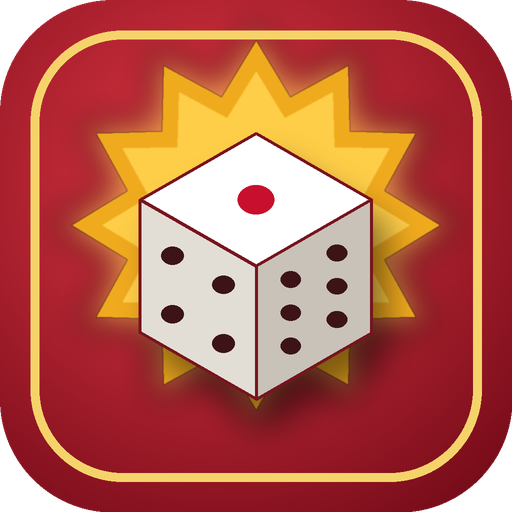

# 🎲 नेपाली लुडो

<p align="center">
  
</p>

<p align="center">
  <strong>खेलौँ, रमाऔँ!</strong>
</p>

<p align="center">
  <a href="https://github.com/your-username/nepali-ludo/releases/latest">
    
  </a>
  <a href="https://github.com/your-username/nepali-ludo/actions">
    
  </a>
  
  
  
</p>

---

A complete, production-ready **Nepali-themed Ludo game** for Android — built with Flutter. Play against AI or with friends on the same device, all in the Nepali language with a distinctive Nepali visual identity.

## 📥 Download

**[Download the latest APK →](https://github.com/your-username/nepali-ludo/releases/latest)**

Install the APK on your Android device and start playing immediately. No internet connection required.

---

## ✨ Features

| Feature | Description |
|---------|-------------|
| 🎲 Classic Ludo | All standard rules: safe cells, captures, exact home entry, extra turns |
| 🤖 AI Opponent | Three difficulty levels: सजिलो / सामान्य / गाह्रो |
| 👥 Local Multiplayer | 2–4 players on the same device |
| 🇳🇵 Nepali UI | Complete Nepali language interface with Devanagari typography |
| 😂 Nepali Reactions | Send fun Nepali expressions during the game |
| 🔔 Game Announcements | छक्का!, काटियो!, घर पुग्यो!, बधाई छ! |
| 🔊 Sound Effects | Dice, movement, captures, win sounds |
| 🏆 Statistics | Games played, wins, losses, streaks, captures |
| 🏅 Achievements | 16 achievements with Nepali names |
| 💾 Save/Resume | Game auto-saves; continue where you left off |
| 📱 Offline | Works completely without internet |
| ⚙️ Settings | Sound, music, vibration, AI difficulty controls |

---

## 📸 Screenshots

| Splash | Home | Game Board |
|--------|------|------------|
| *(Splash screen)* | *(Home screen)* | *(Game in progress)* |

| Statistics | Achievements | Settings |
|------------|--------------|---------|
| *(Stats screen)* | *(Achievements grid)* | *(Settings toggles)* |

---

## 🎮 How to Play

1. **Open the app** and tap **नयाँ खेल** to start a new game
2. **Choose players**: select 2–4 players, set names, and choose Human or AI
3. **Roll the dice**: tap the dice to roll
4. **Move tokens**: tokens start in the yard — you need a 6 to bring them out
5. **Capture opponents**: land on their token to send it back to the yard
6. **Win the game**: get all 4 tokens home first!

### Rules
- Roll a **6** to bring a token out of the yard
- Roll a **6** to get an extra turn
- **Safe cells** (marked with a star) protect tokens from capture
- You need the **exact roll** to reach the finish
- **3 consecutive sixes** forfeit your turn

---

## 🛠️ Development Setup

### Prerequisites

- [Flutter SDK](https://flutter.dev/docs/get-started/install) ≥ 3.22.0
- Android Studio or VS Code
- Android SDK with API level 21+

### Quick Start

```bash
# Clone the repo
git clone https://github.com/your-username/nepali-ludo.git
cd nepali-ludo

# Install dependencies
flutter pub get

# Run on a connected device or emulator
flutter run

# Build a release APK
flutter build apk --release
```

### Running Tests

```bash
flutter test
flutter test --coverage
```

---

## 🏗️ Architecture

```
lib/
├── main.dart                    # Entry point
├── app.dart                     # MaterialApp + Provider setup
├── core/theme/                  # NepaliColors, AppTheme
├── game/
│   ├── engine/                  # Pure Dart game logic
│   │   ├── board_config.dart    # 15×15 board coordinate system
│   │   ├── token.dart           # Token model (positions 0–57)
│   │   ├── player.dart          # Player model
│   │   ├── dice.dart            # Dice (testable, injectable)
│   │   ├── game_event.dart      # Event stream types
│   │   ├── game_state.dart      # Immutable game state
│   │   └── game_engine.dart     # Deterministic game engine
│   ├── ai/
│   │   └── ai_engine.dart       # Easy / Normal / Hard AI
│   └── game_provider.dart       # ChangeNotifier state management
├── l10n/strings.dart            # All Nepali strings
├── storage/                     # SharedPreferences persistence
├── audio/audio_manager.dart     # Sound effects & music
└── ui/
    ├── painters/board_painter.dart   # Custom board drawing
    ├── widgets/                       # DiceWidget, ReactionPanel
    └── screens/                       # All app screens
```

**Key design decisions:**
- Game engine is pure Dart with no Flutter dependency — fully unit-testable
- AI uses a weighted heuristic scoring function for Hard difficulty
- Tokens use local positions (0–57 per player); `BoardConfig` maps to visual cells
- All UI strings centralized in `S` class for future i18n

---

## 🤝 Contributing

Contributions are welcome! Please read [CONTRIBUTING.md](CONTRIBUTING.md) first.

```bash
# Create a feature branch
git checkout -b feature/my-feature

# Make changes, add tests
flutter test

# Submit a pull request
```

---

## 🗺️ Roadmap

### v1.0 ✅ (Current)
- Classic Ludo · AI · Local multiplayer · Nepali UI · Reactions · Sound · Statistics · Offline

### v1.1 🔄
- Online rooms with room codes · Friend system · Improved AI · More avatars

### v1.2 🔜
- User accounts · Online leaderboards · Cloud stats · Match history

### Future
- Tournaments · Voice reactions · Custom boards · Seasonal Nepali themes

---

## 📄 License

MIT License — see [LICENSE](LICENSE) for details.

---

<p align="center">Made with ❤️ for Nepal 🇳🇵</p>
